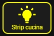
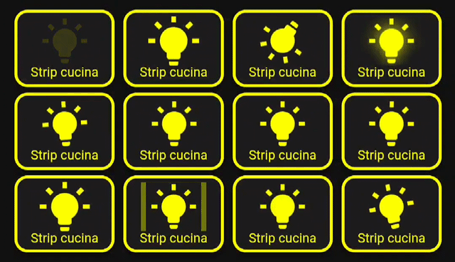

<h2><strong>🎞️ Animation Button-card</strong></h2>

CARD per mostrare come funzionano le diverse animazioni partendo da un pulsante come questo:

Volevo condividere una card che ho creato con l'aiuto delle varie community per accendere luci (per esempio) ma con effetto animazione.

Istruzioni:

da Hacs, installare:
1. button-card

poi ...
1. in HA create una card manuale e incollate il contenuto del file: card.yaml, ovviamente la parte con l'animazione che vi piace di più, non per forza tutti, vi ho lasciato qualche commento all'interno del file per capire da dove parte un bottone e dove finisce.
2. all'interno del codice della card, dovete andare a sostituire "entity: light.striscia_cucina" con la vostra entità che desiderate animare.
3. potete anche andare a cambiare dimensioni carattere ecc nel codice per adattarlo al meglio alla vostra dashboard e utilizzare queste animazione anche per altri tipi di pulsante, non solo luci.

<strong>Alla fine ci troveremo ad avere questo risultato finale:</strong> 

Enjoy!

----------------------------------------

Would you like to give me a hand? The content of this page is completely free of charge and the purpose is certainly not to make money. If you would like to lend me a hand to help with expenses and lost time, you have the following ways:

Make your Amazon purchases from this link:

Join our Telegram channel dedicated to Home Assistant news:

Join our Telegram channel dedicated to home automation products, there are lots of offers:

